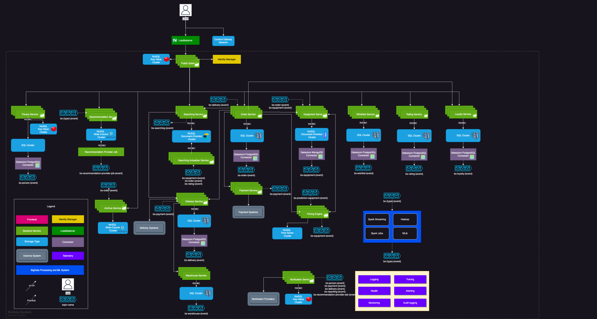
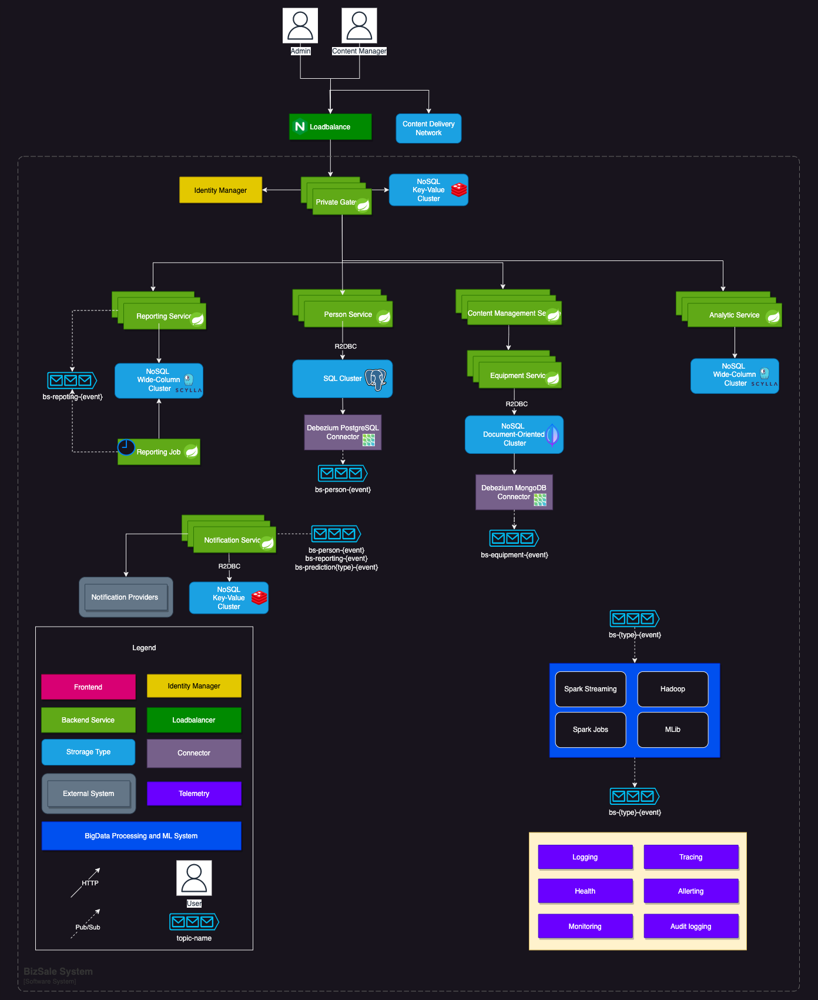

# Catalog Service
[](https://github.com/fragaLY/catalog-service/actions/workflows/catalog-service.yml)

## The catalog service is the aggregator for different providers.

## System Design for the final solution

## How to run

Data is stored and handled by ELK. For caches could be used Redis, only Redis supports reactive caching. See docker-compose.local.yml:

```yml
version: "3.8"

services:
  elasticsearch:
    image: docker.elastic.co/elasticsearch/elasticsearch:${STACK_VERSION}
    container_name: elasticsearch
    environment:
      - xpack.security.enabled=false
      - discovery.type=single-node
    ulimits:
      memlock:
        soft: -1
        hard: -1
      nofile:
        soft: 65536
        hard: 65536
    cap_add:
      - IPC_LOCK
    volumes:
      - elasticsearch-data:/usr/share/elasticsearch/data
    ports:
      - ${ES_PORT}:9200

  kibana:
    container_name: kibana
    image: docker.elastic.co/kibana/kibana:${STACK_VERSION}
    environment:
      - ELASTICSEARCH_HOSTS=http://elasticsearch:9200
    ports:
      - ${KIBANA_PORT}:5601
    depends_on:
      - elasticsearch

  redis:
    image: redis:${REDIS_VERSION}
    restart: always
    environment:
      - ALLOW_EMPTY_PASSWORD=yes
      - REDIS_PASSWORD=${REDIS_PASSWORD}
    ports:
      - ${REDIS_PORT}:6379
    command: redis-server --save 20 1 --loglevel warning
    volumes:
      - cache:/data

volumes:
  elasticsearch-data:
    driver: local
  cache:
    driver: local
```

Feel free to run it to work localy. 
To boot up the application use ```./gradlew bootRun``` command or pull the image ```docker pull fragaly/catalog-service:1.0.0-RC1```.

See the Open Api documentation to be familiar with service API:

```yaml
openapi: "3.0.3"
info:
  title: "catalog_service API"
  description: "catalog_service API"
  version: "1.0.0"
servers:
  - url: "https://localhost:8080"
paths:
  /api/v1/equipments:
    get:
      summary: "GET api/v1/equipments"
      operationId: "get"
      parameters:
        - name: "parameters"
          in: "query"
          required: false
          schema:
            type: "string"
        - name: "page"
          in: "query"
          required: false
          schema:
            type: "integer"
            format: "int32"
            default: "0"
        - name: "size"
          in: "query"
          required: false
          schema:
            type: "integer"
            format: "int32"
            default: "20"
      responses:
        "200":
          description: "OK"
          content:
            '*/*':
              schema:
                type: "array"
                items:
                  $ref: "#/components/schemas/Equipment"
  /api/v1/data/process:
    post:
      summary: "POST api/v1/data/process"
      operationId: "process"
      requestBody:
        content:
          application/json:
            schema:
              type: "string"
      responses:
        "200":
          description: "OK"
          content:
            '*/*':
              schema:
                type: "array"
                items:
                  $ref: "#/components/schemas/Equipment"

components:
  schemas:
    BigDecimal:
      type: "object"
      properties: { }
    Equipment:
      type: "object"
      properties:
        id:
          type: "string"
        brandName:
          type: "string"
        details:
          type: "string"
        sizes:
          type: "array"
          items:
            type: "string"
        mrp:
          type: "string"
        sellPrice:
          $ref: "#/components/schemas/BigDecimal"
        discount:
          $ref: "#/components/schemas/BigDecimal"
        category:
          type: "string"
    DataProcessingPayload:
      type: "object"
      properties:
        uris:
          type: "array"
          items:
            type: "string"
            format: "uri"
```

### Client Side System Design



### Management Side System Design



### Data Migration High Level Design


